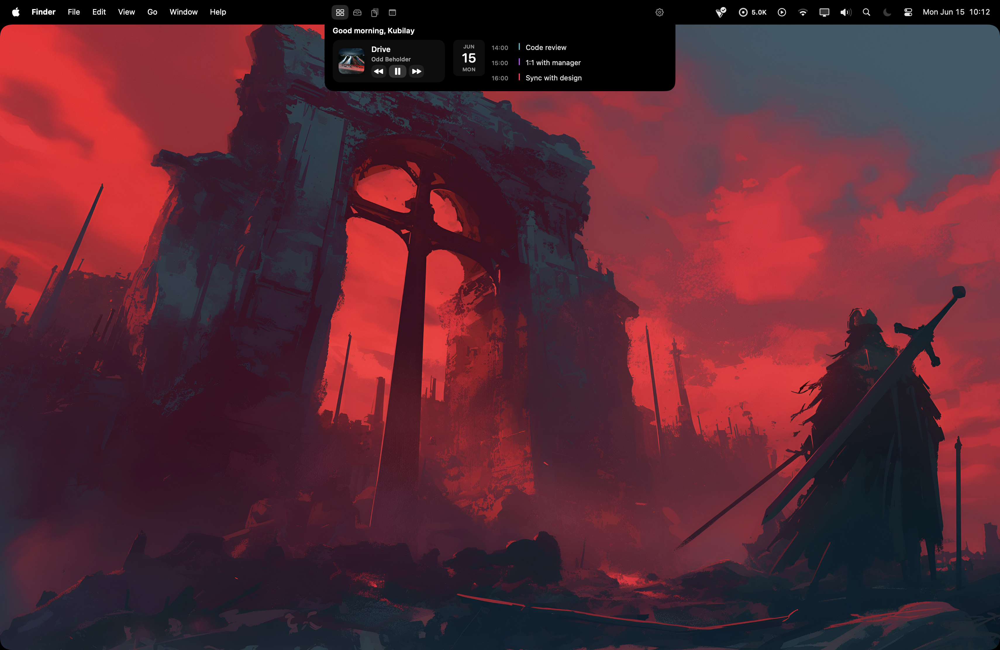

# StupidNotch

Turn the MacBook notch into a useful surface. StupidNotch draws a Dynamic-Island-style panel under the hardware notch — media controls, a file tray, clipboard history, a calendar, battery, and more — that expands on hover and peeks on track changes.



Lightweight Swift / AppKit app. Runs in the background (no Dock icon, no menu-bar clutter), no kernel extensions, no daemons. System-wide Now Playing is read through the bundled [mediaremote-adapter](vendor/mediaremote-adapter) bridge.

## ✨ What you can put in your notch

<table>
<tr>
<td>🎵 <b>Media player</b> — artwork, scrubber, transport, every part toggleable</td>
<td>📊 <b>Visualizer</b> — animated bars, fully tunable</td>
<td>🫀 <b>System pulse</b> — live CPU + RAM as bars / donut / gauge</td>
</tr>
<tr>
<td>🕐 <b>Clock</b> — digital or analog</td>
<td>📅 <b>Date</b> — short / medium / long</td>
<td>🔋 <b>Battery</b> — %, charge color, sizing</td>
</tr>
<tr>
<td>🗓️ <b>Calendar</b> — real events, auto-scrolls to now</td>
<td>⏭️ <b>Next event</b> — your upcoming one, at a glance</td>
<td>👋 <b>Greeting</b> — "Good evening, you"</td>
</tr>
<tr>
<td>🗂️ <b>File tray</b> — drag files in, drag them back out</td>
<td>📋 <b>Clipboard</b> — text + image history</td>
<td>📡 <b>AirDrop</b> — one-tap share the tray</td>
</tr>
</table>

🧩 **Everything is modular** — unlimited tabs, nested stacks, drag-to-reorder, and the same widgets work in the tab body, the peek bands, or the header. Every widget has its own size + option sliders that apply **live**.

🪄 **Plus** — expand-on-hover, sneak-peek on track change, two-finger tab swiping, global hotkeys, wallpaper corner mask, in-app update check, and a universal binary (Apple Silicon + Intel).

## Install

1. Download `StupidNotch.app` from [Releases](../../releases/latest).
2. Drag it to `/Applications`.
3. **First launch** — because the app isn't signed with a paid Apple Developer ID, macOS may block it. Either right-click → **Open** → confirm, or clear the quarantine flag:
   ```bash
   xattr -cr /Applications/StupidNotch.app
   ```
4. The app runs in the background with no Dock or menu-bar icon. To open settings, **hover the notch and click the ⚙️ gear**, or re-open StupidNotch from Finder / Spotlight.

## Usage

- **Hover** the notch to expand it; click the tab icons to switch tabs.
- **Two-finger swipe** across the expanded panel cycles tabs (toggleable).
- **Drag files** onto the Tray tab to stash them; drag them back out anywhere.
- **Settings** (gear in the notch header) lets you build tabs, arrange widgets, set peek/header slots, tune the notch shape, and bind hotkeys.
- **Calendar** asks for access only when you tap **Allow** — it never prompts on launch.

## Modular by design

Nothing about the layout is fixed. The whole notch is a tree of **tabs → stacks → widgets** that you assemble in Settings, and every piece is yours to rearrange.

- **Unlimited tabs** — add as many tabs as you want, each with its own name and SF Symbol icon. Reorder them, rename them, or delete them. The tab switcher in the notch header reflects your set automatically.
- **Nested stacks** — inside a tab, drop widgets into **horizontal** or **vertical** stacks, nest stacks inside stacks, and set each stack's alignment (start / center / end) and spacing. Build a two-column dashboard, a centered row, whatever fits.
- **Drag to reorder** — widgets and stacks reorder by dragging in the canvas; the live notch updates as you go.
- **Three placements, same widget pool** — the *expanded content* (tab body), the *peek slots* (the two bands that flank the physical notch while peeking), and the *expanded header* (the strip around the notch when open) are all configured independently. A battery pill can live in the peek, the header, or a tab — your call.

## Widgets & their knobs

Every widget exposes its own **size** (Width / Height, in points or % of the panel, or Auto) plus widget-specific options — all live-applied:

- **Media player** — toggle each element independently: artwork (with size), title, artist, progress bar, elapsed/remaining times, transport controls, and an inline visualizer. Hide everything but artwork + title for a compact pill, or show the full card.
- **Visualizer** — bar count, bar width, bar spacing, and height scale; alignment (centered / bottom).
- **System pulse** — live CPU + RAM rendered three ways: **bars**, **donut**, or **half-gauge**, each with its own size knob and color thresholds.
- **Clock** — digital or analog face, 12/24-hour, show-seconds, font/face size.
- **Date** — short / medium / long format, font size.
- **Battery** — icon size, show-percentage, and color mode (charge-based / white / accent).
- **Calendar** — compact or full; toggle the date strip and the events list; event limit and font scale. The events list is scrollable and **auto-scrolls to the current time**, dimming past events and emphasizing the ongoing one. All data comes straight from your macOS calendars (no placeholders).
- **Greeting, Next event, Tab switcher, Settings button, AirDrop, Spacer** — each with the options that make sense for it (font size, icon size, spacing…).

## File tray

A drop zone under the notch. Drag files from Finder (or any app) onto the **Tray** tab and they're copied into the app's storage and shown as thumbnail tiles. Drag a tile back out to drop the file anywhere. The AirDrop widget hands the current tray straight to the macOS AirDrop sheet. Drops are handled at the AppKit level so they keep working even with the notch's transparent, always-on-top window.

## Clipboard history

StupidNotch watches the pasteboard and keeps a rolling history of recent **text and image** copies (configurable size). Each entry is a tile in the **Clipboard** tab — tap to copy it back to the pasteboard, or drag it out to paste into another app. Images spill to a temp file on drag so receivers get a real file URL. Bind a global hotkey to pop the clipboard open instantly.

## Build from source

Requires the Xcode command-line tools and macOS 14+.

```bash
git clone https://github.com/kubilaysalih/stupidnotch.git
cd stupidnotch
./build.sh
open StupidNotch.app
```

`build.sh` compiles a universal binary, builds the MediaRemoteAdapter framework, and assembles the `.app` bundle.

## How it works

- The panel is a borderless `NSWindow` pinned just above the menu bar (`.statusBar + 1`), hosting SwiftUI content through `NSHostingView`. The rounded shape is rendered on the window's `CALayer` for crisp, native corners.
- Now Playing comes from the bundled MediaRemoteAdapter Perl bridge, which `dlopen`s the private MediaRemote framework via `/usr/bin/perl` and streams JSON; StupidNotch reads that stream — no private API linkage in the app itself.
- The widget layout is a small tree (`stacks` + `widgets`) serialized to `UserDefaults`, so your arrangement persists.

## Third-party software

StupidNotch bundles [MediaRemoteAdapter](https://github.com/ungive/mediaremote-adapter) (BSD-3-Clause, © 2025 Jonas van den Berg and contributors). Its license ships inside the app bundle and is listed in **Settings → About → Third-party software**.

## License

MIT — see [LICENSE](LICENSE).
